# Flujo de Interaccion

## Diagramas de Secuencia

### Flujo de Mensajeria

Todos los mensajes entre el cliente y el agente siguen este patron:

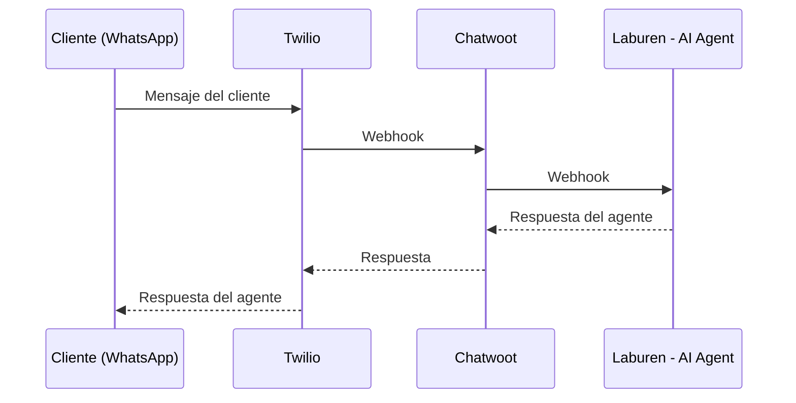

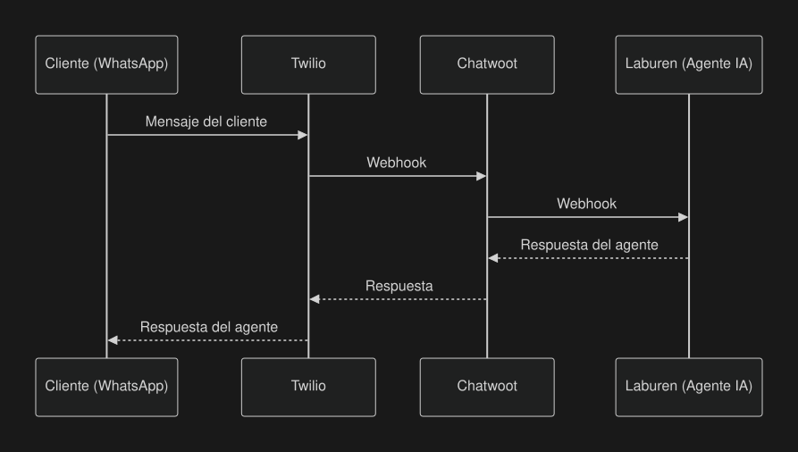

Los siguientes diagramas muestran la interaccion entre el agente y el MCP Server para cada fase.

### Fase 1: Exploracion de Productos

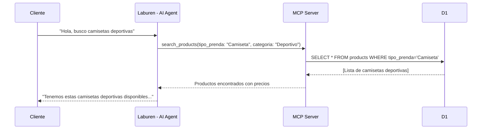

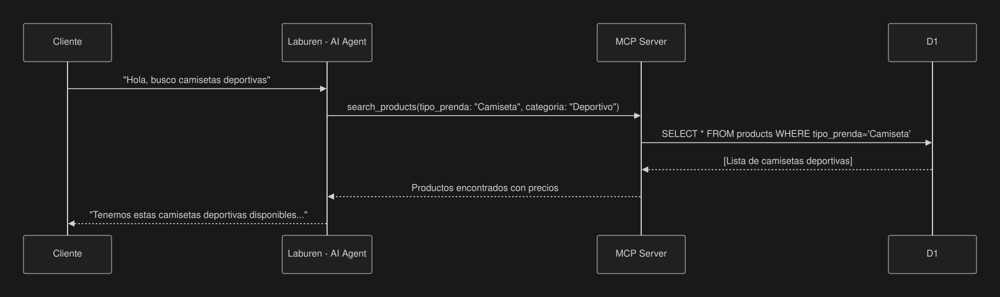

### Fase 2: Detalle de Producto

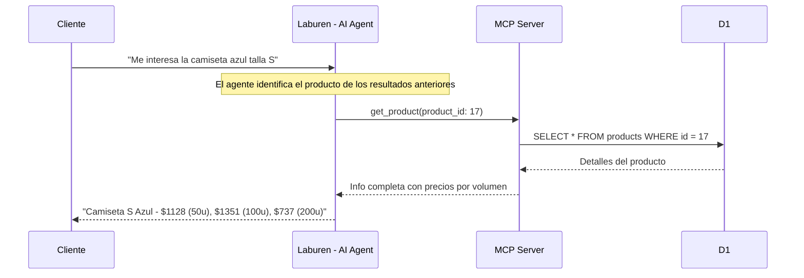

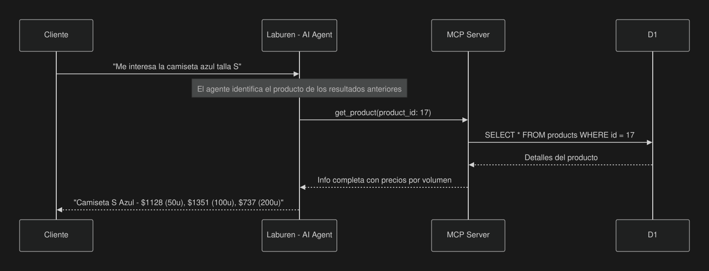

### Fase 3: Creacion de Carrito

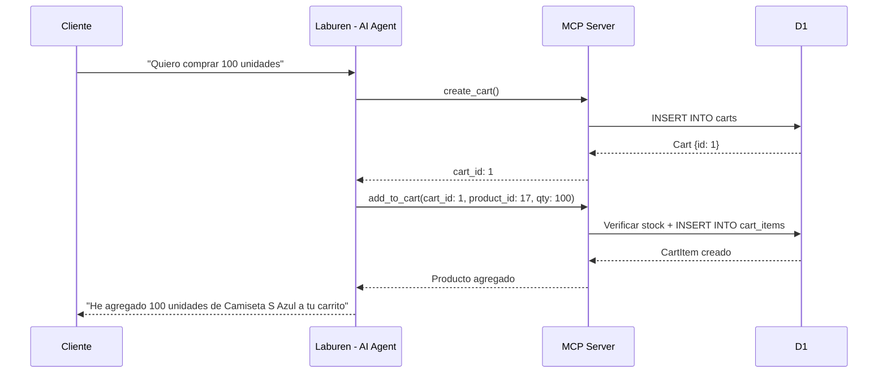

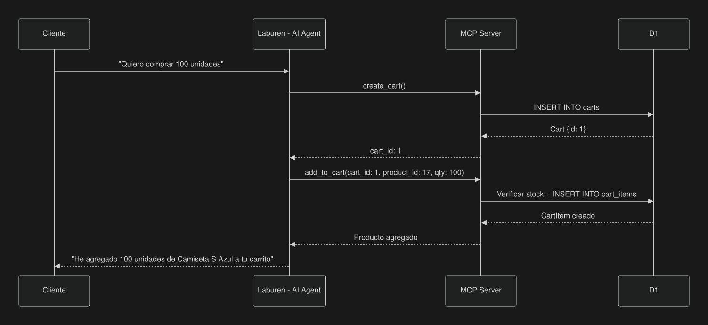

### Fase 4: Edicion del Carrito

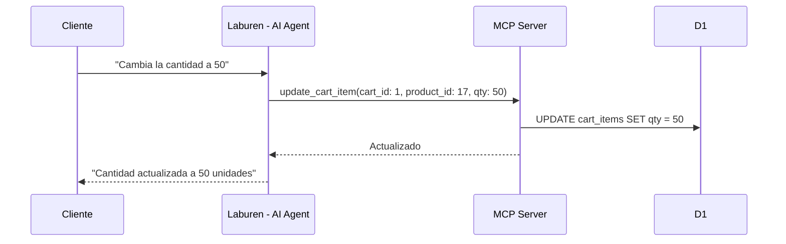

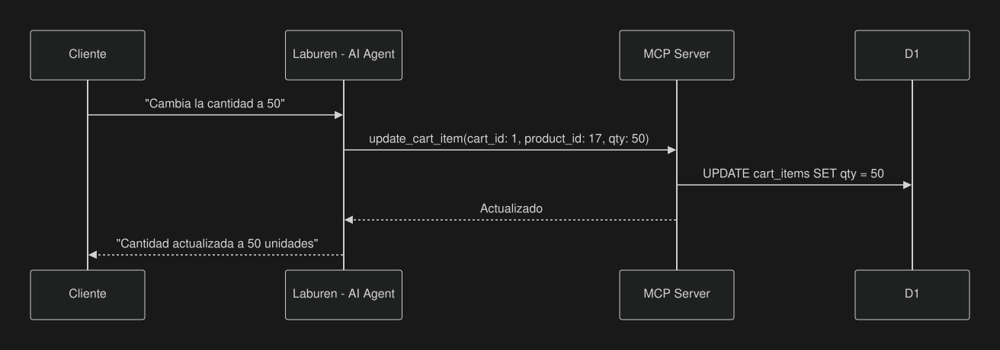

### Fase 5: Revision del Carrito

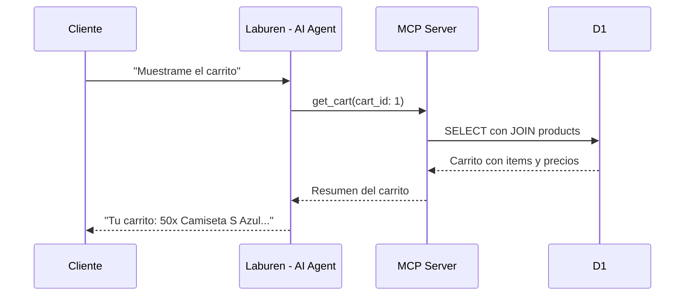

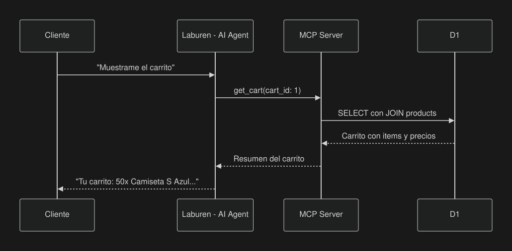

### Fase 6: Escalacion

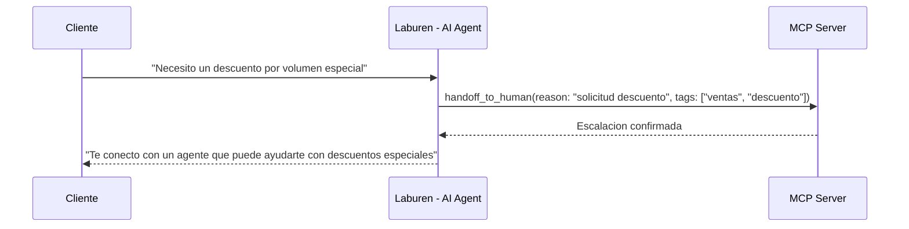

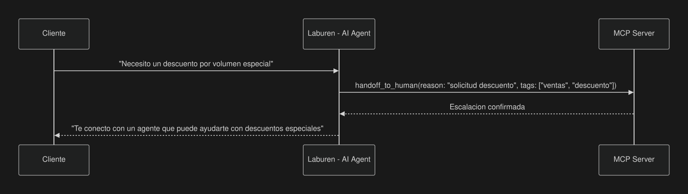

## Diagrama de Componentes

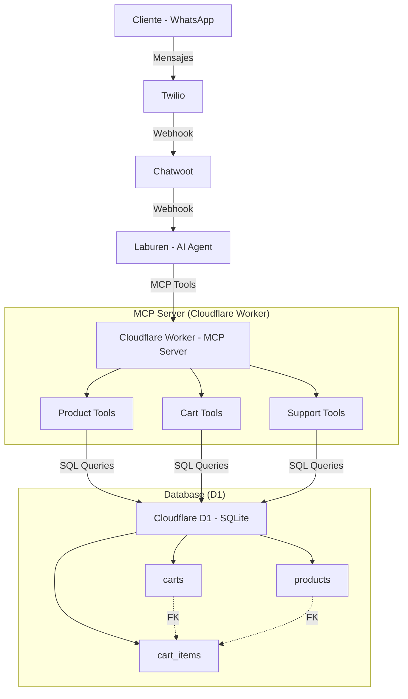

