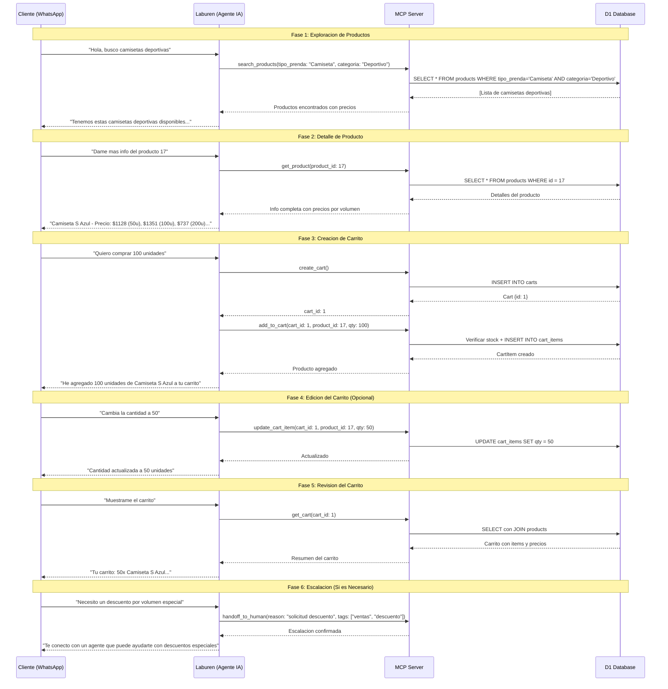
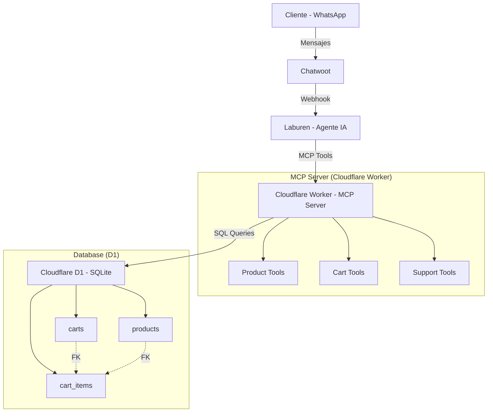

# Flujo de Interaccion

## Diagrama de Secuencia

```mermaid
sequenceDiagram
    participant C as Cliente (WhatsApp)
    participant L as Laburen (Agente IA)
    participant M as MCP Server
    participant D as D1 Database

    Note over C,D: Fase 1: Exploracion de Productos
    C->>L: "Hola, busco camisetas deportivas"
    L->>M: search_products(tipo_prenda: "Camiseta", categoria: "Deportivo")
    M->>D: SELECT * FROM products WHERE tipo_prenda='Camiseta' AND categoria='Deportivo'
    D-->>M: [Lista de camisetas deportivas]
    M-->>L: Productos encontrados con precios
    L-->>C: "Tenemos estas camisetas deportivas disponibles..."

    Note over C,D: Fase 2: Detalle de Producto
    C->>L: "Dame mas info del producto 17"
    L->>M: get_product(product_id: 17)
    M->>D: SELECT * FROM products WHERE id = 17
    D-->>M: Detalles del producto
    M-->>L: Info completa con precios por volumen
    L-->>C: "Camiseta S Azul - Precio: $1128 (50u), $1351 (100u), $737 (200u)..."

    Note over C,D: Fase 3: Creacion de Carrito
    C->>L: "Quiero comprar 100 unidades"
    L->>M: create_cart()
    M->>D: INSERT INTO carts
    D-->>M: Cart {id: 1}
    M-->>L: cart_id: 1

    L->>M: add_to_cart(cart_id: 1, product_id: 17, qty: 100)
    M->>D: Verificar stock + INSERT INTO cart_items
    D-->>M: CartItem creado
    M-->>L: Producto agregado
    L-->>C: "He agregado 100 unidades de Camiseta S Azul a tu carrito"

    Note over C,D: Fase 4: Edicion del Carrito (Opcional)
    C->>L: "Cambia la cantidad a 50"
    L->>M: update_cart_item(cart_id: 1, product_id: 17, qty: 50)
    M->>D: UPDATE cart_items SET qty = 50
    M-->>L: Actualizado
    L-->>C: "Cantidad actualizada a 50 unidades"

    Note over C,D: Fase 5: Revision del Carrito
    C->>L: "Muestrame el carrito"
    L->>M: get_cart(cart_id: 1)
    M->>D: SELECT con JOIN products
    D-->>M: Carrito con items y precios
    M-->>L: Resumen del carrito
    L-->>C: "Tu carrito: 50x Camiseta S Azul..."

    Note over C,D: Fase 6: Escalacion (Si es Necesario)
    C->>L: "Necesito un descuento por volumen especial"
    L->>M: handoff_to_human(reason: "solicitud descuento", tags: ["ventas", "descuento"])
    M-->>L: Escalacion confirmada
    L-->>C: "Te conecto con un agente que puede ayudarte con descuentos especiales"
```

## Diagrama de Componentes

```mermaid
graph TD
    A[Cliente - WhatsApp] -->|Mensajes| B[Chatwoot]
    B -->|Webhook| C[Laburen - Agente IA]
    C -->|MCP Tools| D[Cloudflare Worker - MCP Server]
    D -->|SQL Queries| E[Cloudflare D1 - SQLite]

    subgraph "MCP Server (Cloudflare Worker)"
        D --> F[Product Tools]
        D --> G[Cart Tools]
        D --> H[Support Tools]
    end

    subgraph "Database (D1)"
        E --> I[products]
        E --> J[carts]
        E --> K[cart_items]
    end

    J -.->|FK| K
    I -.->|FK| K
```
